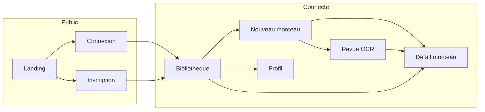

# ChordLearner — Brief de design pour IA (redesign)

Ce document décrit le produit, les écrans et le design actuel. À utiliser **avec** les captures dans [`screenshots/`](./screenshots/) pour guider un redesign (Figma, maquettes, ou refonte UI).

---

## A. Vue d’ensemble du projet

**Nom** : ChordLearner  
**Proposition** : Application web pour **apprendre des morceaux au piano** à partir de **grilles d’accords**.

**Utilisateurs cibles** : Pianistes (amateurs ou intermédiaires) qui veulent :

- Importer ou saisir une grille d’accords (texte, URL de page avec accords, ou photo/PDF via OCR).
- **Voir chaque accord sur un clavier** avec des **voicings** (positions des notes) et des **suggestions de doigtés**.
- **Transposer** le morceau dans une autre tonalité.
- **Sauvegarder des presets** de pratique par morceau.
- Retrouver une **bibliothèque** de morceaux avec recherche et filtre par tonalité.

**Langue de l’interface** : **français** (tous les libellés, messages, erreurs).

**Positionnement marketing (landing)** : « L’app piano pour maîtriser tes accords », gratuite, sans abonnement ni pub (message actuel).

---

## B. Stack et contraintes techniques

Le redesign doit rester **réalisable** dans la stack actuelle :

| Couche | Technologies |
|--------|----------------|
| Framework | Next.js 16 (App Router), React 19, TypeScript |
| Styles | Tailwind CSS 4, variables CSS (`globals.css`) |
| Composants UI | shadcn/ui (Radix) : Button, Card, Input, Label, Badge, Tabs, Select, Textarea, ScrollArea, Separator, Alert |
| Auth & données | Supabase (auth, Postgres, storage) |

**À préserver fonctionnellement** (même si le style change) :

- Grille d’accords interactive (`ChordGridViewer`), sélection d’accord, liste d’accords uniques.
- Visualisation clavier (`PianoKeyboardVisualizer`, `MiniPiano`), sélecteur d’inversions, voicings.
- Formulaires : auth, saisie manuelle, import URL/OCR, profil, presets.
- Navigation : barre d’app (`AppNavbar`) avec liens Morceaux / Nouveau / Profil et déconnexion.

Les **flux métier** (API, parsing d’accords, OCR) ne sont pas à redessiner dans ce brief ; seule l’**expérience visuelle et la hiérarchie d’information** sont visées.

---

## C. Design actuel (référence)

### Palette principale (clair)

| Rôle | Hex (approx.) |
|------|----------------|
| Fond page / crème | `#f8f4ea` |
| Texte principal | `#2d2a24` |
| Texte secondaire | `#5a5246`, `#8e8068`, `#7a6f5c` |
| Bordures / tons chauds | `#d9ccb2`, `#e7decc` |
| Accent (boutons sombres) | `#2d2a24` sur fond clair `#f8f4ea` |

### Tokens applicatifs (`:root` dans `src/app/globals.css`)

Variables utiles pour une refonte cohérente : `--song-bg`, `--song-surface`, `--song-surface-muted`, `--song-border`, `--song-text`, `--song-text-muted`, `--song-accent`, `--song-accent-foreground`, `--song-danger-*`, `--song-shadow`, `--song-shadow-hover`. Une variante **`.dark`** existe pour le mode sombre.

### Typographie

- **Titres / display** : Cormorant Garamond (via `optionBDisplayFont` dans `src/components/option-b/theme.ts`).
- **Corps** : Manrope (`optionBBodyFont`).
- Layout racine : Geist Sans / Geist Mono (moins dominant sur les pages « morceau »).

### Motifs visuels actuels

- Coins arrondis **xl / 2xl** sur cartes et champs.
- Fond des pages authentifiées : classe `.song-shell` (dégradé radial discret depuis le haut).
- Landing : hero **fond très sombre** (`#2d2a24`) avec **clavier décoratif** (touches blanches/noires stylisées, accords C–E–G–C mis en avant), puis sections claires.

### Barre de navigation

- Sticky en haut, fond crème semi-transparent + blur.
- Logo texte « ChordLearner », onglets/liens **Morceaux**, **Nouveau**, **Profil** (état actif : fond sombre, texte clair).
- Email tronqué + bouton **Déconnexion** (utilisateur connecté) ; sinon **Connexion** / **Inscription**.

### Layout global

- `main` : `max-w-6xl`, padding horizontal `px-6`, vertical `py-8` (`src/app/layout.tsx`).

---

## D. Écrans détaillés

### 1. Landing — `/`

**Public.** Si l’utilisateur est **déjà connecté**, redirection vers `/songs` (pas de landing).

**Structure (haut → bas)** :

1. **Hero** (fond sombre)  
   - Surtitre : « L’app piano pour maîtriser tes accords »  
   - Titre : « Joue tes morceaux » + ligne « au piano » en dégradé  
   - Sous-texte : import grille, voicings, transposition, gratuit  
   - CTA : **Commencer gratuitement** (primaire clair), **J’ai déjà un compte** (secondaire bordure)  
   - **Clavier visuel** : rangée de touches, certaines surlignées (C, E, G, C)

2. **Fonctionnalités** — grille **3 colonnes** (6 cartes) : import grilles, voicings clavier, transposition, correction/personnalisation, presets, simple et gratuit.

3. **Comment ça marche** — bandeau légèrement différent (`#f3ede0`), **3 colonnes** numérotées 1–3 : ajouter morceau → explorer voicings → jouer et progresser.

4. **CTA final** — carte centrée bordée, « Prêt à jouer ? », bouton **Commencer maintenant**.

5. **Footer** sombre : marque, liens Mentions légales / CGU / Confidentialité, copyright.

**États** : une seule variante principale (non connecté).

---

### 2. Connexion — `/login`

**Public.** Paramètre `?next=` pour redirection après login.

- En-tête centré : surtitre « Espace membre », titre **Connexion**, texte d’aide.
- **Carte** bordée : formulaire email, mot de passe, soumission, lien vers inscription (`AuthForm` mode login).

**États** : messages d’erreur / succès possibles via query (`message`, `error`).

---

### 3. Inscription — `/signup`

**Public.** Même structure générale que login, formulaire création de compte (`AuthForm` mode signup).

---

### 4. Bibliothèque — `/songs`

**Protégé.**

- Surtitre « Bibliothèque ».
- Titre large : « Travaille tes accords dans de vrais morceaux. » + paragraphe (recherche par titre, artiste, tonalité).
- Bouton **+ Nouveau morceau** (accent) à droite sur desktop.
- Section **Mes morceaux (N)** :
  - **Erreur** : carte rouge si Supabase indisponible (message technique + consigne `.env`).
  - **Vide** : zone en pointillés, texte invitant à ajouter un premier morceau.
  - **Liste** : `SongsBrowser` — barre de recherche avec icône, **filtre par tonalité** (select ou équivalent), grille de **cartes morceau** (`SongCard` : titre, artiste, tonalité, lien vers détail).
- Bandeau citation en bas : phrase motivationnelle sur fond accent.

---

### 5. Nouveau morceau — `/songs/new`

**Protégé.**

- Surtitre « Nouveau morceau », titre « Ajoute un morceau à ton entraînement », texte sur modes d’import.
- **Grille 2 colonnes** (large écran) :
  - **Colonne principale** : carte **Import de grille** (`ImportCard`) — choix **URL / extraction web** vs **upload image ou PDF** (OCR), puis séparateur « ou saisis la grille manuellement », puis **ManualInputForm** (titre, artiste, tonalité, zone texte grille).
  - **Aside** : encadré **Conseils** (liste à puces : retours à la ligne, tonalité, relecture OCR).

---

### 6. Revue OCR / extraction — `/songs/new/ocr-review` et `/songs/[songId]/ocr-review`

**Protégé.** Query typique : `ocrImportId`, `imageUrl` (nouveau morceau).

- Workspace **OCRReviewWorkspace** : bascule **Web** vs **OCR**, formulaire URL ou zone fichier, choix provider OCR, lancer détection, édition des lignes d’accords, aperçu structuré, finalisation vers création / mise à jour morceau.
- Nombreux états : chargement, erreur API, comparaison de providers, texte éditable.

*(Pour le redesign : prévoir des états « vide », « en cours », « résultat + corrections ».)*

---

### 7. Détail morceau — `/songs/[songId]` et `/songs/[songId]/chords`

**Protégé.** Cœur du produit (`SongDetailContent`).

- En-tête morceau : titre, artiste, tonalité, liens/actions secondaires selon implémentation.
- **Onglets internes** (ou équivalent) : **Accords** | **Configurer** (presets) | **Overview** (presets).
- Zone **Accords** typiquement :
  - **KeySelector** : tonalité courante, préférence notation (dièses/bémols), transposition.
  - **ChordGridViewer** : grille cliquable, accords inconnus mis en évidence.
  - **UniqueChordList** : chips / liste des accords uniques.
  - Panneau **accord sélectionné** : **PianoKeyboardVisualizer**, **InversionSelector**, liste des **voicings** (cartes cliquables), **FingeringHintBadge**, indicateur **SaveStatus** (sauvegarde sélection).
- **PresetConfigurator** / **PresetOverview** dans les autres onglets.
- États : chargement (`LoadingStateCard`), erreur chargement grille, notice transposition temporaire.

---

### 8. Profil — `/profil`

**Protégé.**

- Surtitre « Compte », titre « Mon profil », description.
- **Grille 2 colonnes** :
  - Carte **Informations du compte** : email, date « Membre depuis », formulaire nom d’affichage / nom complet (`ProfileForm`), message d’erreur si migration profil absente.
  - Carte **Statistiques** : 4 blocs (Morceaux, Presets, Imports OCR, Extractions).
- Section **Sécurité** : carte avec **SecurityActions** (changement mot de passe, etc.).

---

### 9. Page technique — `/status`

**Protégé.** Liste de checks (variables d’environnement, connectivité). Moins prioritaire pour un redesign marketing, utile pour support / admin.

---

## E. Flux utilisateur principal

**Parcours typique** : Connexion → Bibliothèque → Nouveau morceau (manuel / URL / OCR) → Revue si besoin → Détail morceau (grille + clavier + transposition + presets) → Profil pour compte et stats.

---

## F. Livrables attendus d’une IA de design

- **Système de design** : couleurs, typographie, espacements, états des composants (hover, focus, erreur, disabled).
- **Maquettes** ou spécifications pour les écrans listés en section D, en **cohérence** avec la structure informationnelle ci-dessus.
- **Accessibilité** : contrastes, tailles de cibles tactiles, hiérarchie des titres.
- **Mobile** : la stack est responsive ; préciser les breakpoints pour bibliothèque, grille d’accords et clavier.

---

## G. Fichiers clés dans le dépôt

| Fichier / dossier | Rôle |
|-------------------|------|
| [`src/app/page.tsx`](../src/app/page.tsx) | Landing |
| [`src/app/layout.tsx`](../src/app/layout.tsx) | Navbar + `main` |
| [`src/components/app-navbar.tsx`](../src/components/app-navbar.tsx) | Navigation |
| [`src/app/globals.css`](../src/app/globals.css) | Tokens `--song-*`, `.song-shell` |
| [`src/components/option-b/theme.ts`](../src/components/option-b/theme.ts) | Polices display / body |
| [`src/components/song-detail-content.tsx`](../src/components/song-detail-content.tsx) | Vue morceau principale |

---

## H. Captures d’écran

Voir le guide dédié : [`SCREENSHOTS-GUIDE.md`](./SCREENSHOTS-GUIDE.md). Les images finales doivent être placées dans [`screenshots/`](./screenshots/).

Automatisation (pages publiques + optionnel pages connectées) : script [`scripts/capture-screenshots.mjs`](../scripts/capture-screenshots.mjs), commande `npm run screenshots` après `npx playwright install chromium`.
